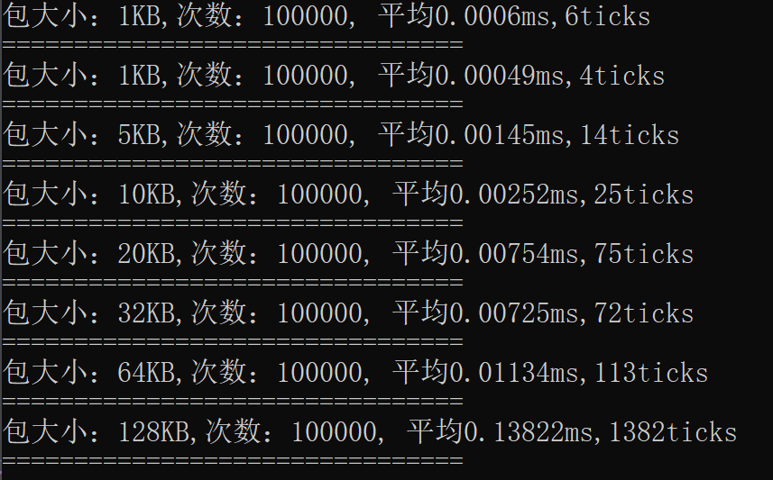
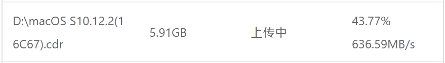

<!--
 * @Author: snltty
 * @Date: 2021-08-22 14:09:03
 * @LastEditors: snltty
 * @LastEditTime: 2022-08-01 16:17:49
 * @version: v1.0.0
 * @Descripttion: 功能说明
 * @FilePath: \client.service.ui.webd:\Desktop\p2p-tunnel\README.md
-->

# p2p-tunnel
## Visual Studio 2022 LTSC 17.2

1. **/public/publish.rar包含win linux mac下依赖.NET6环境的x64和arm64**，更多环境的发布程序，请自行发布，或者进群获取
2. <a href="http://snltty.gitee.io/p2p-tunnel/" target="_blank">在线web管理端</a>，<a href="https://www.cnblogs.com/snltty/" target="_blank">使用说明</a>，<a href="https://update7.simplix.info/UpdatePack7R2.exe" target="_blank">win7不能运行.NET6的补丁</a>
3. 自己开通的网络更容易打洞，当使用租房的房东网络时，打洞比较困难
4. 服务器 或 内网电脑，暴露服务在公网时，请做好安全防范

## 通信线路
1. p2p、A<---->B
2. 中继、A<---->server<---->B（免费打洞服务器不开启）
3. 服务器代理、server<---->A（免费打洞服务器不开启）

## 通信模式
1. **udp转发**1对1
1. **tcp转发**1对1
2. **http1.1代理**多对多
3. **socks5代理**多对多

## 通信流程
1. A <--tcp转发-->B<---->内网服务
1. A <--udp转发-->B<---->内网服务
2. server <--tcp转发-->A<---->内网服务
2. server <--udp转发-->A<---->内网服务
3. A <--http1.1代理-->B<---->内网或外网服务
4. A <--http1.1代理-->server<---->内网或外网服务
5. A <--socks5代理-->B<---->内网或外网服务
6. A <--socks5代理-->server<---->内网或外网服务
  
## 要点
- [x] .NET6 跨平台，小尺寸，小内存<a href="https://github.com/RevenantX/LiteNetLib" target="_blank">LiteNetLib rudp</a>，<a href="https://github.com/statianzo/Fleck" target="_blank">fleck websocket</a>
- [x] 内网穿透 访问内网web，内网桌面，及其它TCP上层协议服务 windows<-->windows 可使用mstsc，其它可使用 TightVNC
- [x] p2p 打洞、tcp、udp
- [x] tcp转发
- [x] udp转发
- [x] http代理
- [x] socks5代理(支持tcp，udp，不实现bind)
- [x] 简单易用的客户端web管理页面
- [x] 方便使用的命令行管理命令
- [x] 支持通信数据加密
- [x] 可扩展的插件式
- [x] 免费的打洞服务器
- [x] 高效的打包解包，序列化->打包->粘包解析->解包->反序列化 整个流程时间，作死的全手写序列化

## QQ群
有啥兴趣，有啥想了解的，尽可进群

## 项目
1. client
    1. plugins
        1. client.service.ui //客户端的管理工具
            1. client.service.ui.api  //接口定义， 这样可以在开发别的插件的时候也使用ui配置
            2. client.service.ui.api.manager    //服务器管理接口，与服务器端对应
            3. client.service.ui.api.service //服务
            4. client.service.ui.api.webrtc
            5. client.service.ui.web //web界面
        2. client.service.ftp 客户端服务的  文件服务插件
        3. client.service.logger  日志记录的web展示
        4. client.service.socks5  socks5代理客户端及服务端
        5. client.service.tcpforward tcp转发，及 http代理
        5. client.service.udpforward udp转发
    2. client 客户端公共内容
    3. client.service **客户端**
    4. client.service.command 客户端命令行管理工具
    5. client.service.tary 客户端托盘工具
2. common 一些公共的功能
    1. common.libs 一些公共的功能
    2. common.server 服务器
    3. common.socks5 socks5代理(支持tcp、udp，不实现bind)
    4. common.tcpforward tcp转发公共定义
    4. common.udpforward udp转发公共定义
3. server
    1. plugins
        1. server.service.manager 服务端管理接口
        2. server.service.manager.models 服务端管理接口定义
        3. server.service.socks5 socks5代理服务端
        4. server.service.tcpforward 服务端代理转发，实现内网穿透
        4. server.service.udpforward 服务端代理转发，实现内网穿透
        5. server.service.webrtc webrtc
        6. server.service.webrtc.models
    2. server //打洞服务端定义
    3. server.service **服务端**

